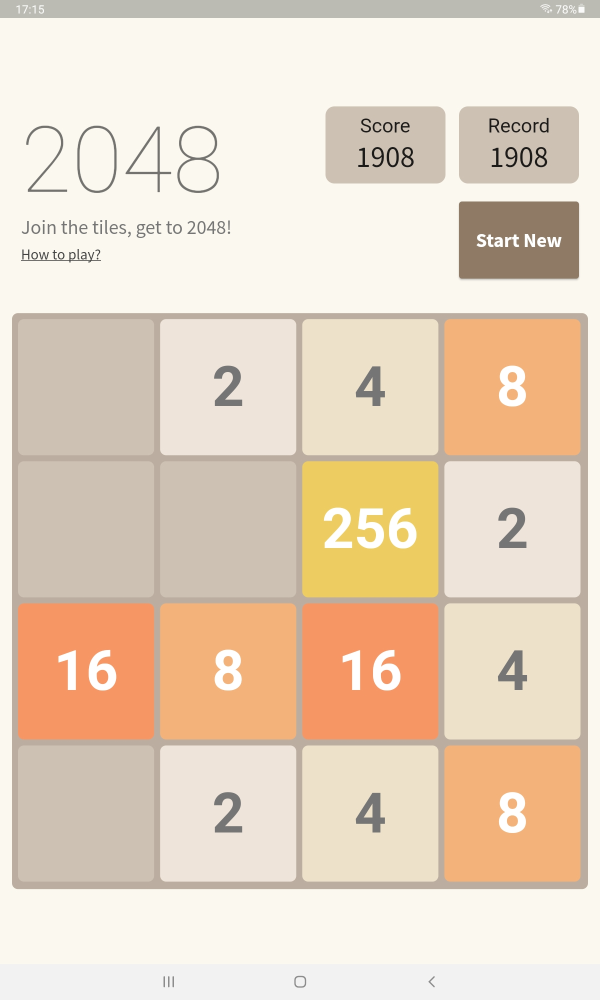
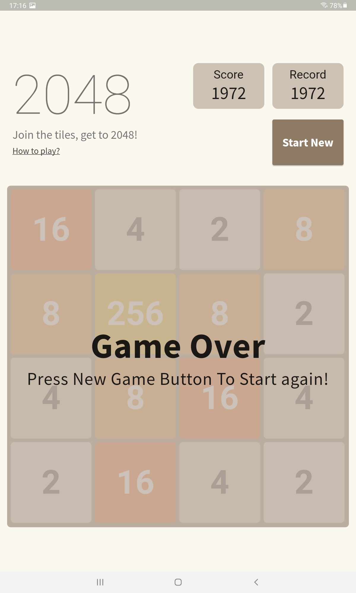

# game_2048

A simple implementation of 2048 puzzle game 🎮, using pure flutter.

## About project

This project is a hard coding of a puzzle game, so I didn't care about responsive design, even the design at self, so the only thing I had cared about is the logic behind some thing like this.

Maybe in the future I'll add some animation and makeing this project responsive and adaptive.

Follow me on:
- [GitHub](https://github.com/elbeicktalat)
- [Twitter](https://twitter.com/elbeicktalat)
- [Linkedin](https://www.linkedin.com/in/elbeicktalat)

Or email me directly on [My Email](mailto:talatelbeick@gmail.com)

